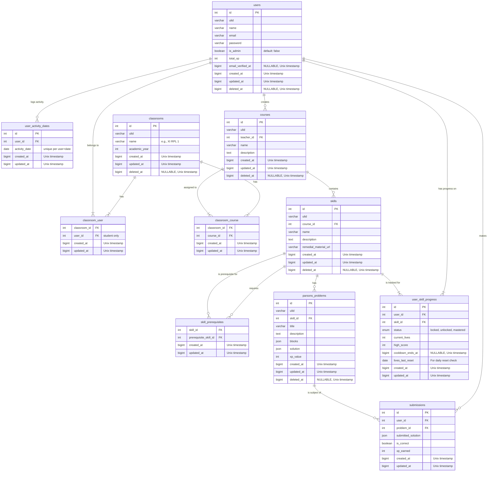

```mermaid
erDiagram
    users {
        int id PK
        varchar ulid
        varchar name
        varchar email
        varchar password
        boolean is_admin "default: false"
        int total_xp
        bigint email_verified_at "NULLABLE, Unix timestamp"
        bigint created_at "Unix timestamp"
        bigint updated_at "Unix timestamp"
        bigint deleted_at "NULLABLE, Unix timestamp"
    }

    user_activity_dates {
        int id PK
        int user_id FK
        date activity_date "unique per user+date"
        bigint created_at "Unix timestamp"
        bigint updated_at "Unix timestamp"
    }

    classrooms {
        int id PK
        varchar ulid
        varchar name "e.g., XI RPL 1"
        int academic_year
        bigint created_at "Unix timestamp"
        bigint updated_at "Unix timestamp"
        bigint deleted_at "NULLABLE, Unix timestamp"
    }

    classroom_user {
        int classroom_id FK
        int user_id FK "student only"
        bigint created_at "Unix timestamp"
        bigint updated_at "Unix timestamp"
    }

    courses {
        int id PK
        varchar ulid
        int teacher_id FK
        varchar name
        text description
        bigint created_at "Unix timestamp"
        bigint updated_at "Unix timestamp"
        bigint deleted_at "NULLABLE, Unix timestamp"
    }

    classroom_course {
        int classroom_id FK
        int course_id FK
        bigint created_at "Unix timestamp"
        bigint updated_at "Unix timestamp"
    }

    skills {
        int id PK
        varchar ulid
        int course_id FK
        varchar name
        text description
        varchar remedial_material_url
        bigint created_at "Unix timestamp"
        bigint updated_at "Unix timestamp"
        bigint deleted_at "NULLABLE, Unix timestamp"
    }

    skill_prerequisites {
        int skill_id FK
        int prerequisite_skill_id FK
        bigint created_at "Unix timestamp"
        bigint updated_at "Unix timestamp"
    }

    parsons_problems {
        int id PK
        varchar ulid
        int skill_id FK
        varchar title
        text description
        json blocks
        json solution
        int xp_value
        bigint created_at "Unix timestamp"
        bigint updated_at "Unix timestamp"
        bigint deleted_at "NULLABLE, Unix timestamp"
    }

    user_skill_progress {
        int id PK
        int user_id FK
        int skill_id FK
        enum status "locked, unlocked, mastered"
        int current_lives
        int high_score
        bigint cooldown_ends_at "NULLABLE, Unix timestamp"
        date lives_last_reset "For daily reset check"
        bigint created_at "Unix timestamp"
        bigint updated_at "Unix timestamp"
    }

    submissions {
        int id PK
        int user_id FK
        int problem_id FK
        json submitted_solution
        boolean is_correct
        int xp_earned
        bigint created_at "Unix timestamp"
        bigint updated_at "Unix timestamp"
    }

    users ||--o{ user_activity_dates : "logs activity"
    users ||--o{ courses : "creates"
    classrooms ||--|{ classroom_user : "has"
    users ||--|{ classroom_user : "belongs to"
    classrooms ||--|{ classroom_course : "has"
    courses ||--|{ classroom_course : "assigned to"
    courses ||--o{ skills : "contains"
    skills ||--o{ parsons_problems : "has"
    skills ||--o{ skill_prerequisites : "requires"
    skills ||--o{ skill_prerequisites : "is prerequisite for"
    users ||--|{ user_skill_progress : "has progress on"
    skills ||--|{ user_skill_progress : "is tracked for"
    users ||--o{ submissions : "makes"
    parsons_problems ||--o{ submissions : "is subject of"
```